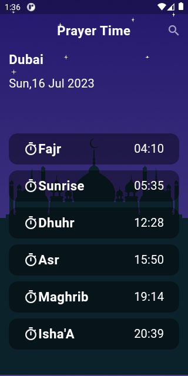
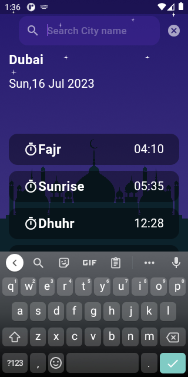
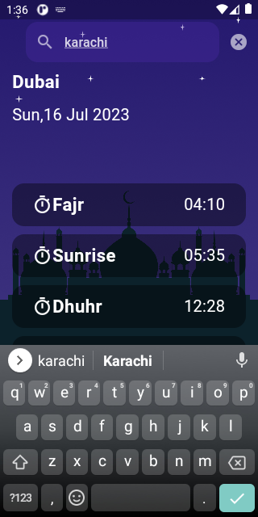
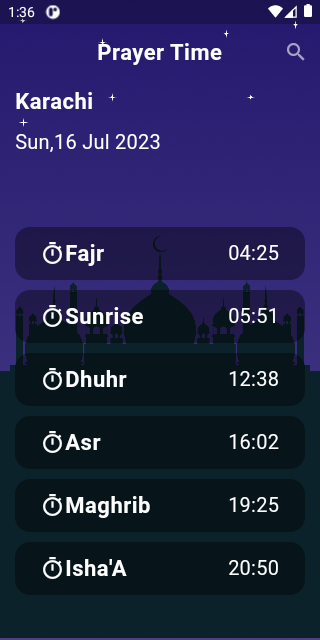

# Prayer Time App

Flutter project of Prayer Time wrt Cities, using api  
 [Prayer Time API](https://dailyprayer.abdulrcs.repl.co/api/karachi)

## ScreenShot
Initially Karachi location is set and when from Search bar you search city then It will change.
  

